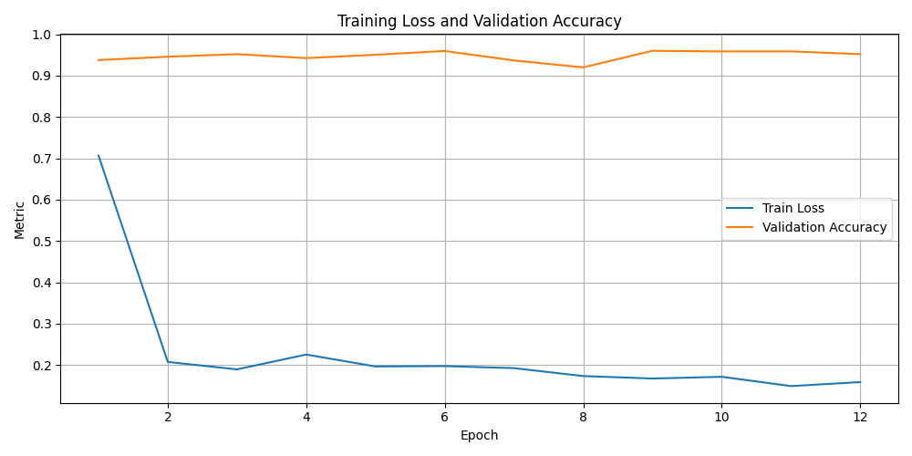

# Pneumonia Detection with a Convolutional Neural Network (Python / PyTorch)

[](https://www.python.org/)
[](https://pytorch.org/)

A complete, reproducible pipeline to detect **pneumonia** from chest-X-ray images using a compact Convolutional Neural Network (CNN) built in PyTorch.  
The project covers data downloading, preprocessing, training with early stopping, metric logging, visualisation and inference.

---

## Highlights

| Feature | Description |
|---------|-------------|
| **End-to-end code** | Data download, split, training, evaluation, plotting, logging — all in one repo. |
| **Early Stopping** | Stops training automatically when validation accuracy plateaus. |
| **Regularisation** | Batch Normalisation and Dropout layers improve generalisation. |
| **Threshold Tuning** | Custom probability threshold for recall-critical clinical scenarios. |
| **Google Colab Demo** | Try the trained model interactively — no local setup required. |

---

## Table of Contents
1. [Quick Start](#quick-start)  
2. [Google Colab Demo](#google-colab-demo)  
3. [Dataset](#dataset)  
4. [Model Architecture](#model-architecture)  
5. [Training & Evaluation Results](#training--evaluation-results)  
6. [Project Structure](#project-structure)  
7. [Future Work](#future-work)  
8. [License](#license)  

---

## Quick Start

```bash
# 1  Clone the repo
git clone https://github.com/<YOUR-GITHUB-USER>/<YOUR-REPO>.git
cd <YOUR-REPO>

# 2  (Optional) create virtual environment
python -m venv .venv
source .venv/bin/activate      # Windows → .venv\Scripts\activate

# 3  Install dependencies
pip install -r requirements.txt

# 4  Run the full training pipeline
python src/main.py \
    --data_dir ./data \
    --model_dir ./models \
    --epochs 20 \
    --batch_size 32 \
    --lr 0.001
````

> **Tip:** use a GPU (Google Colab, Kaggle free GPU or a local CUDA device) for much faster training.

---

## Google Colab Demo

Run live inference with the trained model and a couple of sample X-rays:

[](YOUR-COLAB-LINK)

The notebook:

1. Clones this repository.
2. Downloads the pretrained weight file.
3. Runs predictions on sample chest X-ray images.
4. Displays predicted class and probability.

---

## Dataset

| Property               | Value                                  |
| ---------------------- | -------------------------------------- |
| **Source**             | Kaggle  [link](YOUR-KAGGLE-LINK)       |
| **Images**             | ≈ 5 000 labelled chest X-rays          |
| **Classes**            | *NORMAL* & *PNEUMONIA*                 |
| **Train / Val / Test** | 60 %  /  20 %  /  20 %                 |
| **Pre-processing**     | Resize → 224×224, normalise to $-1, 1$ |

---

## Model Architecture

```
Input : 3 × 224 × 224
└─ Conv(3→16, 3×3) + BatchNorm + ReLU
   └─ MaxPool(2)
      └─ Conv(16→32, 3×3) + BatchNorm + ReLU
         └─ MaxPool(2)
            └─ Flatten
               └─ Linear(32·56·56 → 112) + Dropout(0.5) + ReLU
                  └─ Linear(112 → 84) + Dropout(0.2) + ReLU
                     └─ Linear(84 → 2 logits)
```

A full parameter summary is saved to `figures/model_summary.txt`.

---

## Training & Evaluation Results

| Metric                       | Value    |
| ---------------------------- | -------- |
| **Best Validation Accuracy** | **0.95** |
| **Test Accuracy**            | **0.94** |
| **AUC-ROC**                  | **0.99** |
| **Recall @ threshold 0.5**   | **0.98** |

<p align="center">
  
  
</p>

---

## Project Structure

```
pneumonia-cnn-pytorch
├── src/                  # Source code
│   ├── main.py           # Entry-point script
│   ├── model.py          # CNN definition
│   ├── train.py          # Training loop + early stopping
│   ├── evaluate.py       # Evaluation / confusion matrix
│   ├── dataLoader.py     # DataLoaders
│   ├── prepareData.py    # Download + split dataset
│   └── visualization.py  # Plotting helpers
│
├── models/               # best_model.pt (generated after training)
├── figures/              # PNG plots, confusion matrix, model_summary.txt, training_log.csv
├── requirements.txt
└── README.md
```

---

## Future Work

* Data augmentation (flips, rotations, contrast jitter).
* Transfer-learning baseline (e.g. ResNet-18).
* Hyper-parameter sweep (learning rate, batch size, optimiser).
* Streamlit / Gradio web interface for clinicians.


---
## License

This work is licensed under a [Creative Commons Attribution-NonCommercial 4.0 International License](https://creativecommons.org/licenses/by-nc/4.0/).

You are free to:
- Share — copy and redistribute the material
- Adapt — remix, transform, and build upon the material

**Under the following terms**:
- Attribution — You must give appropriate credit to the original author.
- NonCommercial — You may not use the material for commercial purposes.

To use this work commercially, please contact the author.

---
> **Author:** Cristina L. A.   |   June 2025
