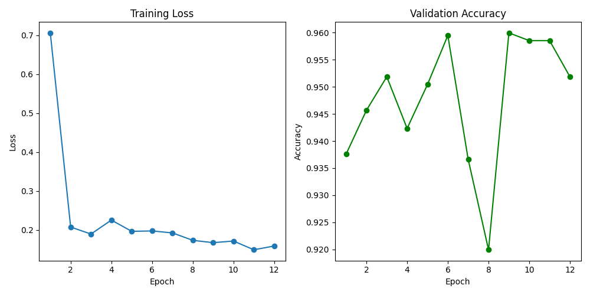
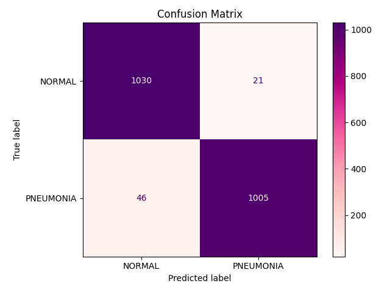

# Pneumonia Detection with a Convolutional Neural Network (PyTorch)

[](https://www.python.org/)
[](https://pytorch.org/)
[](https://creativecommons.org/licenses/by-nc/4.0/)

A complete, reproducible pipeline to detect **pneumonia** from chest-X-ray images using a compact Convolutional Neural Network built in PyTorch.  
The project covers data preparation, training with early stopping, metric logging, visualisation, threshold tuning and inference.

---

## Highlights

| Feature | Description |
|---------|-------------|
| **End-to-end code** | Download → split → train → evaluate → plots → logs. |
| **Early Stopping**  | Stops when validation accuracy stops improving. |
| **Regularisation**  | Batch Normalisation & Dropout. |
| **Threshold tuning** | Trade-off between recall & precision (important in medicine). |
| **Google Colab demo** | Run the model in one click, no local setup. |

---

## Table of Contents
1. [Quick Start](#quick-start)  
2. [Google Colab Demo](#google-colab-demo)  
3. [Dataset](#dataset)  
4. [Model Architecture](#model-architecture)  
5. [Training & Evaluation Results](#training--evaluation-results)  
6. [Project Structure](#project-structure)  
7. [Future Work](#future-work)  
8. [License](#license)  

---

## Quick Start

### 1.  Clone the repo
````
git clone https://github.com/crislpzalc/Pneumonia_detection_CNN.git
cd Pneumonia_detection_CNN
````
### 2.  (optional) Create virtual environment
````
python -m venv .venv
source .venv/bin/activate           # Windows → .venv\Scripts\activate
````
### 3.  Install dependencies
````
pip install -r requirements.txt
````
### 4.  Run the full training pipeline (downloads ≈190 MB)
````
python src/main.py \
    --data_dir ./data \
    --model_dir ./models \
    --epochs 20 \
    --batch_size 32 \
    --lr 0.001
````

> **Tip:** a free GPU on Google Colab or Kaggle speeds training dramatically.

---

## Google Colab Demo

Run live inference with the trained model and sample X-rays:

[](YOUR-COLAB-LINK)

The notebook:

1. Clones this repository.
2. Downloads `best_model.pt`.
3. Runs predictions on two sample X-ray images (one NORMAL, one PNEUMONIA).
4. Displays probabilities and predicted label.

---

## Dataset

| Property               | Value                                                        |
| ---------------------- | ------------------------------------------------------------ |
| **Source**             | [Kaggle – “Neumona X-rays dataset”](https://www.kaggle.com/datasets/gonzajl/neumona-x-rays-dataset) |
| **Images**             | 6 298 (≈ 50 % Pneumonia / 50 % Normal)                       |
| **Train / Val / Test** | 60 % / 20 % / 20 %                                           |
| **Pre-processing**     | Resize → 224 × 224 px  •  Normalise to $-1, 1 $              |

> ⚠️ Due to size constraints, data is not included in the repository.
---

## Model Architecture

```
Input : 3 × 224 × 224
└─ Conv(3→16, 3×3) + BatchNorm + ReLU
   └─ MaxPool(2)
      └─ Conv(16→32, 3×3) + BatchNorm + ReLU
         └─ MaxPool(2)
            └─ Flatten
               └─ Linear(100352 → 112) + Dropout(0.5) + ReLU
                  └─ Linear(112 → 84)   + Dropout(0.2) + ReLU
                     └─ Linear(84  → 2 logits)
Total parameters ≈ 11.3 M
```

Full parameter summary saved to **`figures/model_summary.txt`**.

---

## Training & Evaluation Results

| Metric (threshold = 0.5)     | Value     |
| ---------------------------- | --------- |
| **Best Validation Accuracy** | **0.960** |
| **Test Accuracy**            | **0.968** |
| **Test Precision (Pos.)**    | **0.98**  |
| **Test Recall (Pos.)**       | **0.96**  |
| **F1-score (macro)**         | **0.97**  |
| **AUC-ROC**                  | **0.99**  |

<p align="center">
  
  
</p>

### ⚖ Threshold discussion

The default decision threshold (0.5) yields **46 false negatives** (patients with pneumonia predicted as normal).
In a clinical context we favour **higher recall** to minimise missed cases. Lowering the threshold (e.g. 0.25) eliminates false negatives at the cost of more false positives. The Colab notebook shows how to experiment with different thresholds and visualise precision/recall trade-offs.

---

## Project Structure

```
pneumonia-cnn-pytorch
├── src/
│   ├── main.py           # Entry-point script (argparse)
│   ├── model.py          # CNN definition
│   ├── train.py          # Training loop + early stopping
│   ├── evaluate.py       # Validation & test evaluation
│   ├── dataLoader.py     # DataLoaders
│   ├── prepareData.py    # Download & split dataset
│   └── visualization.py  # Plotting utilities
│
├── models/               # best_model.pt (generated)
├── figures/              # plots, confusion matrix, model summary, training_log.csv
├── data/                  
├── requirements.txt
└── README.md
```
> ⚠️ Due to file size limits on GitHub, the trained model (`best_model.pt`) is available through the [Google Colab Demo](#demo-google-colab)
---

## Future Work

* Apply data augmentation (random flips, rotations, brightness jitter).
* Compare against a **ResNet-18** transfer-learning baseline.
* Hyper-parameter sweep with Optuna (learning-rate, batch size, optimiser).
* Streamlit / Gradio web interface for clinicians to upload X-rays easily.

---

## License

This work is licensed under a
[Creative Commons Attribution-NonCommercial 4.0 International License](https://creativecommons.org/licenses/by-nc/4.0/).

You are free to **share** and **adapt** the material **for non-commercial purposes**, provided you give appropriate credit to the author.
For any commercial usage, please contact me beforehand.

---

> **Author:** Cristina L. A., June 2025
